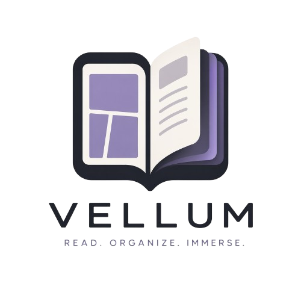
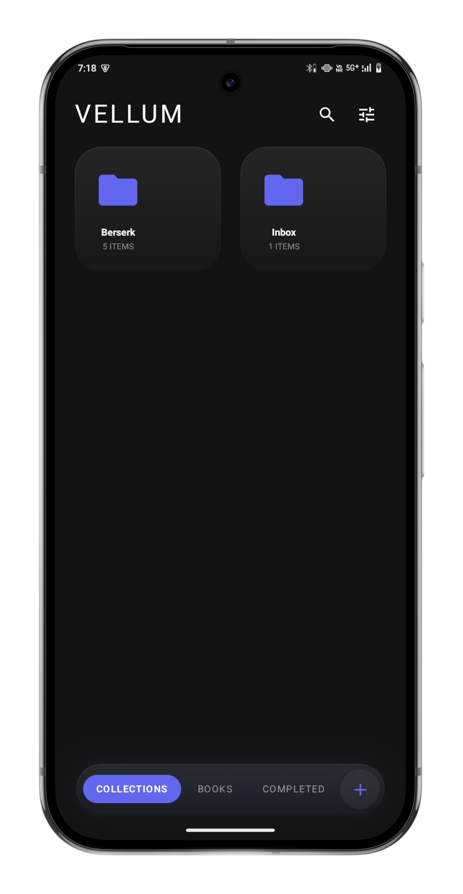
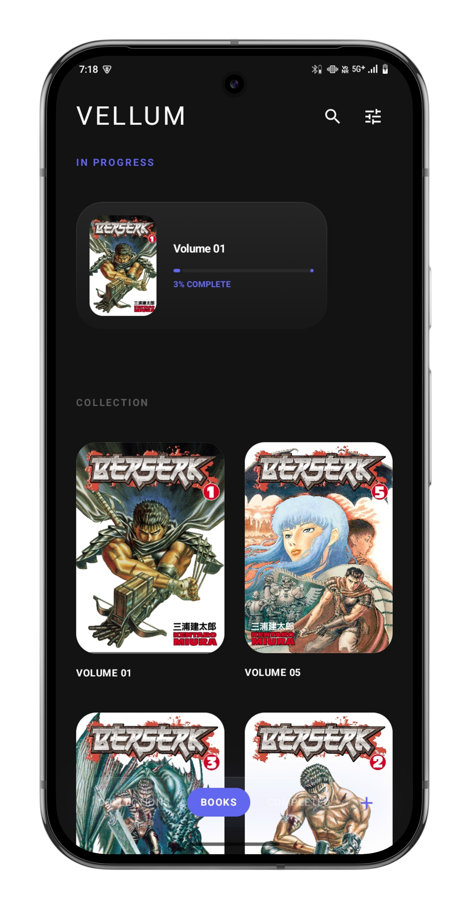
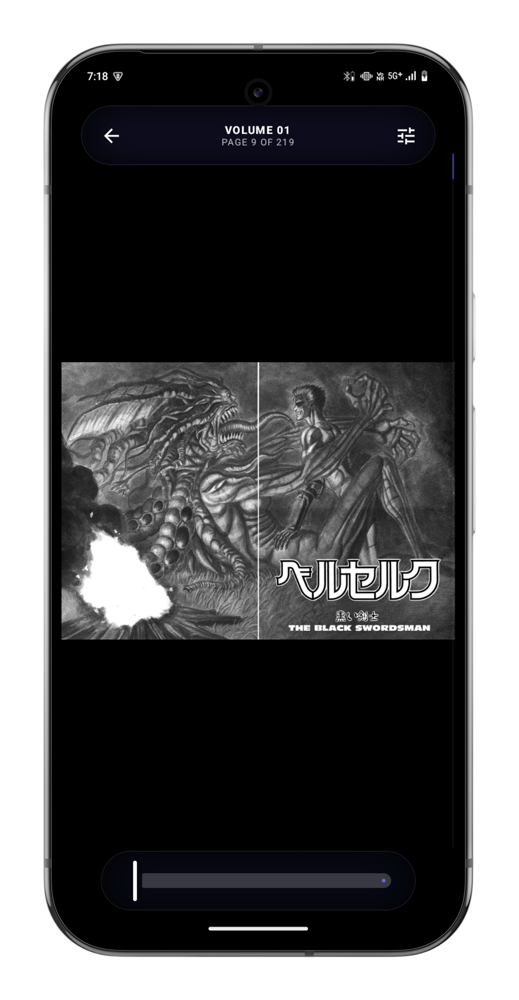

  

  Vellum is a minimalist reader for Android. It provides a focused environment for Comic Archives (CBZ), EPUBs, and PDFs, utilizing high-contrast design and glassmorphic interfaces.

  
  
  

## Features

#### Reading
- Support for CBZ, PDF, and EPUB formats.
- Vertical progress tracking on the right edge of the screen.
- Support for Right-to-Left reading.
- Navigation via volume keys or customizable tap zones.
- Adaptive chromaticity that shifts UI tones based on content.

#### Integration
- Support for opening archives from external applications.
- Automatic integration of external files into local archives.
- Recursive folder scanning for collection building.
- State management through backup and restore functionality.

## Tech Stack

- Kotlin and Jetpack Compose.
- Coroutines and Flow for asynchronous operations.
- Hilt for dependency injection.
- Room and Paging 3 for data management.
- Coil 3 for hardware-accelerated image decoding.
- Dynamic font integration.

## Getting Started

#### Installation
1. Install the application on a device running Android 8.0 or higher.
2. Use the plus icon in the bottom dock to scan folders or import files.
3. Tap the center of the screen during reading to toggle navigation docks.

#### Development
1. Clone the repository.
2. Open in Android Studio (Ladybug 2024.2.1 or higher).
3. Use JDK 17 for the build environment.
4. Build using Gradle Kotlin DSL.
